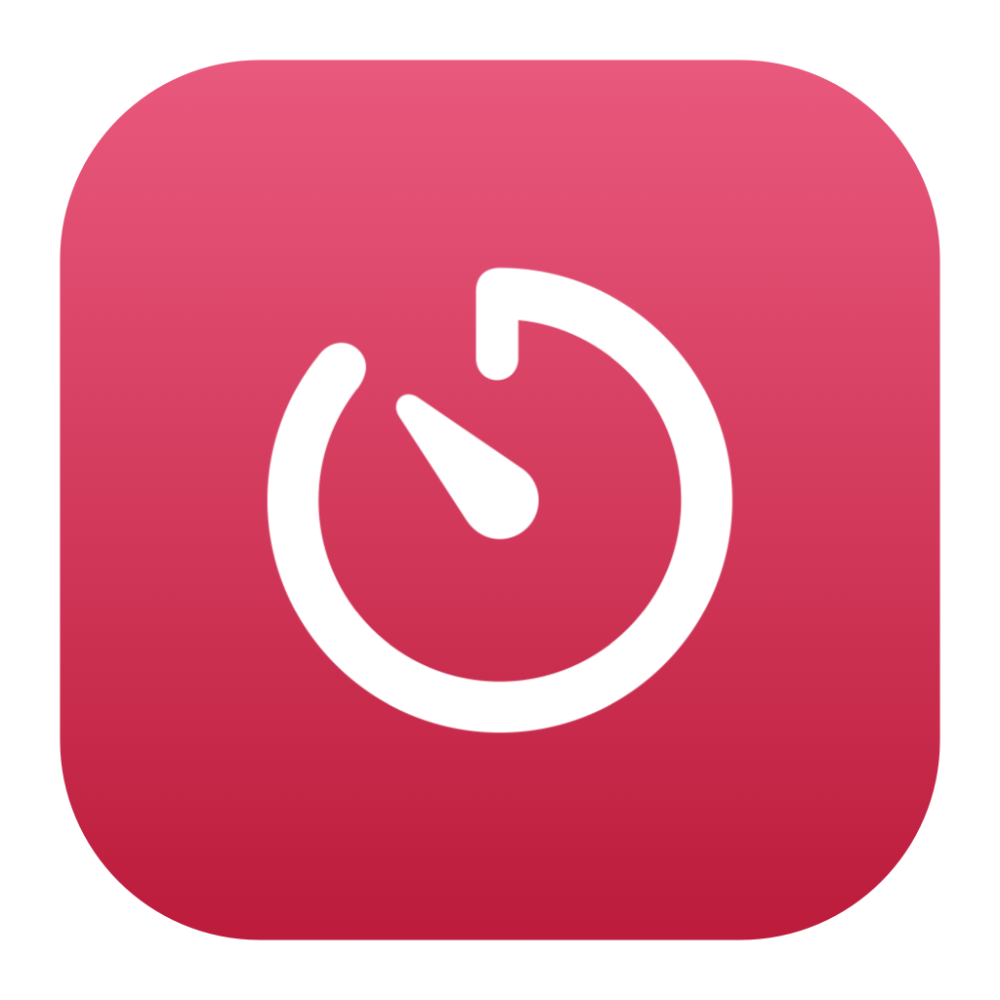
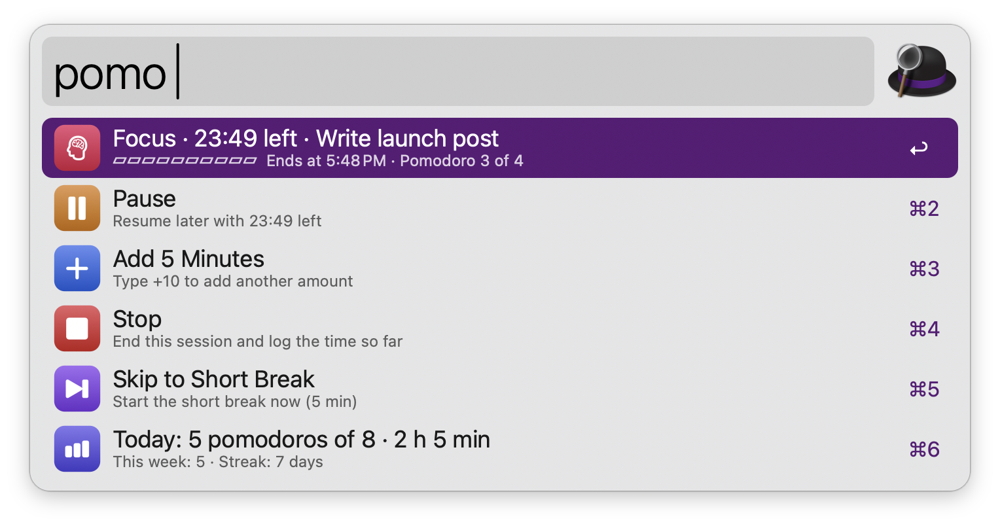
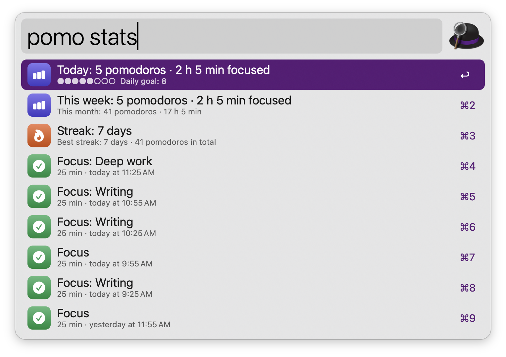
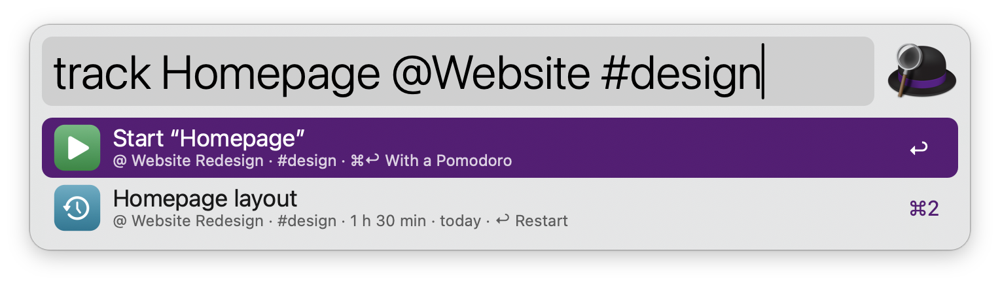

#  Focus Timer

A Pomodoro timer with stats, plus Toggl Track and Clockify time tracking, in Alfred. No dependencies: everything runs on tools that ship with macOS.

## Usage

Start a focus session, a short break or a long break via the `pomo` keyword. While a session runs, the same keyword shows the time left and lets you pause, resume, stop, skip or add time. Type a length and an optional label to start a custom session, like `pomo 50 write report` or `pomo 1h30`. Type `short 10` or `long` to start a break.



* <kbd>↩</kbd> Start the session, or pause and resume the running one.
* <kbd>⌘</kbd><kbd>↩</kbd> Stop the running session and log the time so far.
* <kbd>⌥</kbd><kbd>↩</kbd> Skip to the next session.

A notification and a sound mark the end of each session, even if the Mac was asleep in between. After a restart, a running session catches up the next time you open Focus Timer. After four focus sessions the next break is a long one; the count starts again after three idle hours. Lengths, sound and automatic starts are set in the Workflow’s Configuration, which can also run a Shortcut when a focus session starts and ends, for example to turn a Focus mode on and off.

### Stats

See today’s and this week’s Pomodoros, focused time, your daily goal and your streak via the `pomo stats` keyword.



### Time Tracking

Choose Toggl Track or Clockify in the Workflow’s Configuration, then start a timer via the `track` keyword. Type what you’re working on, with an optional project and tags, like `track writing docs @website #writing`. Type `@` to pick a project. With an empty query, it shows the running timer, the time tracked today and your recent entries.



* <kbd>↩</kbd> Start the timer, restart a recent entry, or stop the running timer.
* <kbd>⌘</kbd><kbd>↩</kbd> Start the timer together with a Pomodoro focus session; the timer stops when the session ends.

The first time, press <kbd>↩</kbd> to paste your API token. It is stored in your macOS Keychain. Type `track workspace` to change the workspace and `track token` to replace the token.

Alternatively, start a timer for the selected text via the Universal Action.

To track every focus session automatically, turn on Pomodoro tracking in the Workflow’s Configuration. The timer keeps running while a session is paused.

Every keyword can be changed in the Workflow’s Configuration.

## Development

```bash
swift tools/make_icons.swift tools/icons.json src   # regenerate icons
python3 tools/build.py --package                     # write src/info.plist and dist/*.alfredworkflow
python3 tests/test_focus.py                          # run the tests
```

## AI disclosure

This workflow was developed with the help of Claude (Anthropic), an AI assistant. The code is reviewed and tested by the author.
